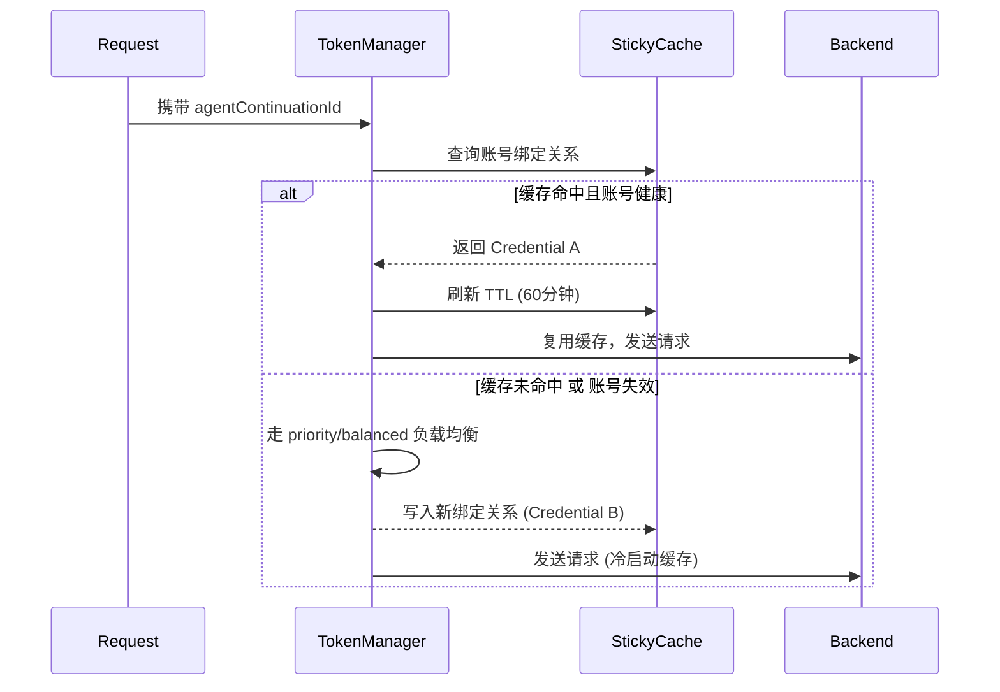

# Kiro 缓存与状态管理全景解析

本文档集中梳理了 `kiro2cc-proxy` 中与 Kiro API 缓存、会话路由以及底层状态管理相关的所有机制和技术实现细节。在反向代理中，**缓存是降低 API 成本和提高响应速度的绝对核心**。

---

## 目录
1. [Prompt Caching（前缀缓存）机制](#1-prompt-caching前缀缓存机制)
2. [跨轮次状态冻结（PREV_H0 & PREV_TOOLS）](#2-跨轮次状态冻结prev_h0--prev_tools)
3. [会话粘性路由（Sticky Cache）](#3-会话粘性路由sticky-cache)
4. [缓存命中验证与 Token 反推](#4-缓存命中验证与-token-反推)
5. [底层性能优化实现（O(1) 淘汰与异步写）](#5-底层性能优化实现o1-淘汰与异步写)

---

## 1. Prompt Caching（前缀缓存）机制

**大白话**：Kiro 后端（基于 AWS Q）会自动对历史消息进行 KV Cache（键值缓存）。如果相邻两次请求的消息前缀完全一致，能极大提升首字响应速度（TTFT）并享受 **90% 的 input token 计费折扣**（缓存命中按全价 10% 计费，跨会话生效）。

### 1.1 计费模型与缓存折扣（重要）
**结论**：Kiro 具有跨会话生效的前缀缓存机制，缓存命中部分按全价 10% 计费（与 Anthropic prompt caching 定价一致）。

- `meteringEvent` 帧不直接返回 `cache_read_input_tokens` 字段，但**缓存折扣体现在 `usage` credits 中**——命中缓存时实际计费远低于全价基准。
- Proxy 通过 `infer_cache_read_tokens()` 反推缓存命中量：对比「无缓存基准费用」与「实际 credits」的差值，除以 `0.9 × rate` 得到 cache_read tokens。实测误差 < 0.1%。
- **缓存跨会话生效**：新会话首轮即可命中 ~88% 缓存（system prompt + tools 前缀被 Kiro 服务端持久缓存），后续 turn 命中率达 97-99%。
- 保持 `agentContinuationId` + 冻结 history[0]/history[2] 的收益：**降低首字延迟（TTFT）+ 节省约 90% 的 input credits**。
- 降低 credits 消耗的手段：① 稳定前缀以提高缓存命中率（冻结 system prompt、tools 定义）；② 缩短非缓存部分（新增对话消息）。

**上下文窗口映射（2026-06-15 实测）**：
- opus-4.7 / opus-4.8 / sonnet-4.6：`contextUsagePercentage` 按 **1,000,000** 窗口计算
- 其余模型：按 **200,000** 窗口计算

**参考费率（k_ref = credits per $1 USD）**：
| 模型 | k_ref | input_price ($/M) | cache_read 折扣 |
|------|-------|-------------------|----------------|
| sonnet 系列 | 7.06 | $3.0 | 10% 全价 |
| opus-4.7 / 4.8 | 2.60 | $15.0 | 10% 全价 |
| opus-4.5 / 4.6 | 2.40 | $15.0 | 10% 全价 |

### 1.2 核心标识符：`agentContinuationId`
Kiro 识别“同一会话连续请求”的唯一凭证是 `agentContinuationId`。如果每次请求这个 ID 都发生变化，Kiro 后端就会将其视为全新会话，前缀缓存将完全失效。

代理层针对不同客户端的派生逻辑：
1. **标准 Claude Code 客户端**：Claude Code 会在请求中附带 `metadata.user_id`（如 `user_xxx_account__session_0b4445...`）。代理提取出 `session_UUID` 作为 `conversationId`。
2. **第三方客户端（Fallback 降级机制）**：对于无 `metadata` 的客户端（如 Cursor、Zed、Open WebUI），若按默认生成随机 UUID，会导致每一轮都是新会话。因此引入了 Fallback 逻辑：
   - 将**截断的 System Prompt + 排序后的工具名列表**进行 `SHA-256` 计算。
   - 由此派生出稳定的 UUID，使得无状态客户端在不改变系统设定时也能享受连续缓存。
3. **最终格式化**：`agentContinuationId` 由 `SHA-256("agent-continuation:" + conversationId)` 格式化得出，确保即使同一会话也能对外部保持哈希安全性。

### 1.2 Tools 注入 `history` 结构
Claude Code 通常携带大量工具定义（例如默认携带 bash、edit 等工具，JSON Schema 占用可达 30K+ tokens）。若将全量工具定义存放在本轮的 `currentMessage` 中，Kiro 会将其视为“新内容”而拒绝缓存。

**代理的“偷梁换柱”方案**：
- **完整 Schema 注入历史**：将全量 `tools` 数组转换为历史消息，固定放置在 `history[2]` (User 角色) 和 `history[3]` (Assistant 角色：仅回复 "OK")。因为历史消息是按顺序缓存的，这使得庞大的工具定义被前缀缓存完美覆盖。
- **Slim Tools 触发器**：为了让 Kiro 知道本轮需要使用工具（激活 `toolUseEvent`），在 `currentMessage.userInputMessageContext.tools` 中仅放入极简的 `slim_tools`。
  - `slim_tools` 仅保留工具的 `name` 和截断为 **1 个字符** 的 `description`，同时清空 `inputSchema`。
  - 这使得原本 30K+ 的 Token 开销缩减至约 1680 tokens，成功欺骗 Kiro 激活工具调用模式，同时不破坏前缀缓存。

---

## 2. 跨轮次状态冻结（PREV_H0 & PREV_TOOLS）

要命中 Kiro 的前缀缓存，不仅会话 ID 要一致，**历史内容本身必须逐字节（Byte-by-byte）完全一致**。Claude Code 每次请求都会变动系统提示中的某些元数据，导致哈希漂移，代理必须强行“冻结”它们。

### 2.1 冻结 `history[0]` (System Prompt)
**问题根源**：
Claude Code 在系统提示的首行会动态注入以下字段：
- `cch`（计费哈希，每次请求随机改变）。
- `cc_version`（版本更新后改变）。
- `gitStatus` 和 `currentDate`（随代码修改和时间推移改变）。
这些易变字段会导致 `history[0]` 内容哈希每次请求都不同，引发缓存穿透。

**双重解决方案**：
1. **字符串洗白**：`normalize_billing_header()` 通过正则定位 `cch=xxx;`，强制将其替换为固定的 `cch=0;`。
2. **全局缓存冻结 (`PREV_H0`)**：代理在内存中维护 `PREV_H0`。首轮请求到达时，将清理后的 `history[0]` 内容绑定到 `session_id` 冻结存入内存。后续同一会话的所有请求，直接忽略客户端发来的系统提示，强制复用首轮内容，实现哈希绝对稳定。

### 2.2 冻结 `history[2]` (Tools)
虽然工具定义列表变化不频繁，但有时（如动态注册 MCP 工具）会发生微小变动。代理同样引入 `PREV_TOOLS` 全局缓存，只要工具定义的 JSON 未发生大变动，就强制复用上一轮的工具序列化结果。

### 2.3 $O(1)$ 伪随机 LRU 淘汰机制
为防止 `PREV_H0` 和 `PREV_TOOLS` 在长期运行中引发内存泄漏，代理设置了全局 `SESSION_CACHE_CAPACITY = 1024` 的容量上限。
- **放弃时间排序**：在早期的实现中，采用的是遍历对比最后访问时间的 $O(N)$ 淘汰策略。在互斥锁 (`Mutex`) 保护下，高并发会导致严重的锁阻塞。
- **$O(1)$ 伪随机驱逐**：重构后，当容量满时，直接通过 `HashMap::keys().next()` 获取伪随机键进行删除。由于系统侧重高吞吐，随机牺牲掉 1/1024 的会话（下次请求大不了重新缓存）远比阻塞整个代理线程要划算得多。

---

## 3. 会话粘性路由（Sticky Cache）

**核心矛盾**：`kiro2cc-proxy` 支持多 Kiro 账号（Credential）轮询与故障转移。但是，Kiro 的 Prompt Cache 是在物理层面**按账号隔离**的。如果一个会话第一轮请求落在账号 A，第二轮被负载均衡分配到账号 B，那么该会话的前缀缓存将彻底作废，导致 Token 成本暴增。

### 3.1 粘性路由流转机制
为解决此问题，代理实现了基于 `agentContinuationId` 的 Sticky Cache 路由机制。



### 3.2 埋点指标与跨账号预热
- **无锁指标监控**：在路由过程中，代理利用 `AtomicU64` 精准打点 `sticky_hits` 和 `sticky_misses`，并通过 `/api/admin/rpm` 接口实时暴露，供管理员监控粘性路由健康度。
- **缓存隔离预热**：两个不同的 credential 各自被选中并预热后，缓存各自在 Kiro 服务端独立保留。中途若因 `429 限流` 等不可抗力被逼轮换，切回原账号后将直接命中缓存，无需重新预热。

---

## 4. 缓存命中验证与 Token 反推

AWS Q / Kiro 的流式响应中，`meteringEvent` 不直接返回 `cache_read_input_tokens` 字段，但缓存折扣体现在 `usage` credits 数值中。代理层通过数学反推，从实际扣费中精确还原缓存命中量。

### 4.1 `effective_rate`（有效费率标定）
代理在日志中记录了去噪后的有效费率：
`effective_rate = metering_credits / (input_tokens + 5 × output_tokens) × 1000`
*(注：公式中的 `5` 是消除 Output token 价格比差异的乘数)*

- **首轮（跨会话缓存命中 system+tools）**：sonnet-4.6 约 `0.0044`（已享受 ~88% 缓存折扣）
- **后续 turn（高缓存命中）**：降至 `0.0022-0.0025`（~97-99% 命中率）
- **理论无缓存全价**：`k_ref × input_price / 1M = 7.06 × 3.0 / 1,000,000 = 0.02118` credits/token

### 4.2 反推公式 (`infer_cache_read_tokens`)
代理通过以下三步逆向工程，精确还原 Kiro 服务端的缓存命中 token 数：

1. **剔除输出成本**：Output 部分没有缓存折扣，先从总 credits 中减去。
   `output_credits = k_ref * output_price * output_tokens / 1,000,000`
2. **计算基准期望**：如果完全没有缓存，Input 本该消耗的 credits。
   `baseline = rate * total_input_tokens`（rate = k_ref × input_price / 1,000,000）
3. **计算折扣 Token**：由于 Cache Read 仅收取 10% 的价格（90% 折扣），baseline 与 actual 的差额即为缓存节省。
   `cache_read_tokens = (baseline - actual_input_credits) / (0.9 * rate)`

**精度验证（2026-06-15 实测）**：
- Turn 11：反推 cache_read = 90,598，日志报告 90,608（取整误差 10 tokens）
- Turn 1：反推 cache_read = 62,435，日志报告 62,436（误差 1 token）

**上下文窗口对结果的影响**：
- `input_tokens` 来自 `contextUsagePercentage × window_size`，窗口大小直接决定 input_tokens 绝对值
- opus-4.7/4.8/sonnet-4.6 必须用 1M 窗口，否则 input_tokens 被压缩为 1/5，导致 credits_per_ktok 虚高，看起来像"无折扣全价"
- 这是此前错误地得出"Kiro 不传递 cache 折扣"结论的根本原因

反推得出的 `cache_read_tokens` 最终封装进 `message_delta` SSE 帧的 `usage` 字段中，使 Claude Code 能准确显示缓存节省量。

---

## 5. 底层性能优化实现（O(1) 淘汰与异步写）

为保障缓存操作与统计追踪在高并发下不会成为系统瓶颈，底层实施了核心重构（阶段 1 P0 级优化）：

### 5.1 RPM 监控：无锁环形桶 (Ring Buffer)
- **旧方案缺陷**：使用 `Vec<Instant>` 无脑追加请求时间戳，仅在调用后台 API 时才执行 `.retain()` 剔除过期数据。长期运行会导致 OOM 和数组扫描的高昂 CPU 开销。
- **重构方案**：采用定长环形数组 `[Bucket; 60]`（对应 60 秒时间窗）。
  ```rust
  let index = (now_secs as usize) % 60;
  // 直接覆盖或累加对应秒数的槽位，实现 O(1) 复杂度的更新与统计
  ```
- **收益**：天然支持滑动时间窗的数据过期与覆盖，内存消耗永远恒定，彻底消除了 OOM 隐患。

### 5.2 统计落盘：异步 MPSC 与防抖写 (Write-Behind)
- **旧方案缺陷**：对涉及磁盘写操作的 `UsageTracker`、`ThrottleLog` 和 `FailureLog`，每次请求结束都在 HTTP 处理线程同步调用 `fs::write`，当磁盘 IO 抖动时直接卡死 Tokio Worker。
- **重构方案**：
  - 引入 `tokio::sync::mpsc::unbounded_channel` 以无锁方式传递日志事件脏信号。
  - 后台衍生出专门的 `tokio::spawn` 异步任务，设定每 5 秒定期利用 `spawn_blocking` 进行批量防抖写盘（Debounce）。
  - **Graceful Shutdown**：接管应用退出信号，确保进程被关闭时，后台通道能被清空并执行最后一次强制落盘，确保财务级计费数据的绝对安全。
